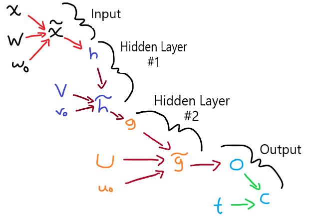
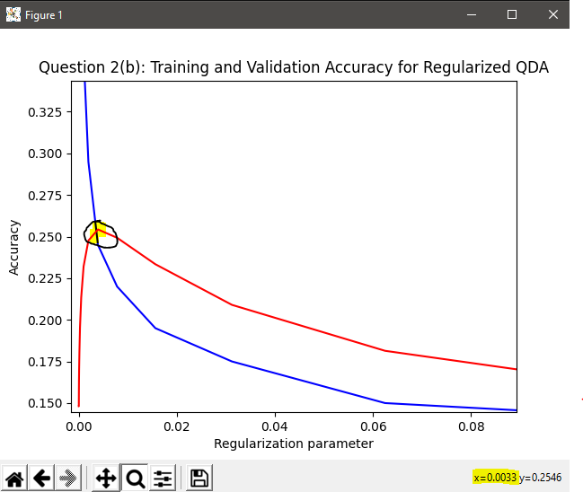
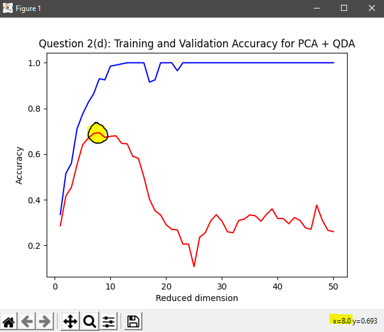
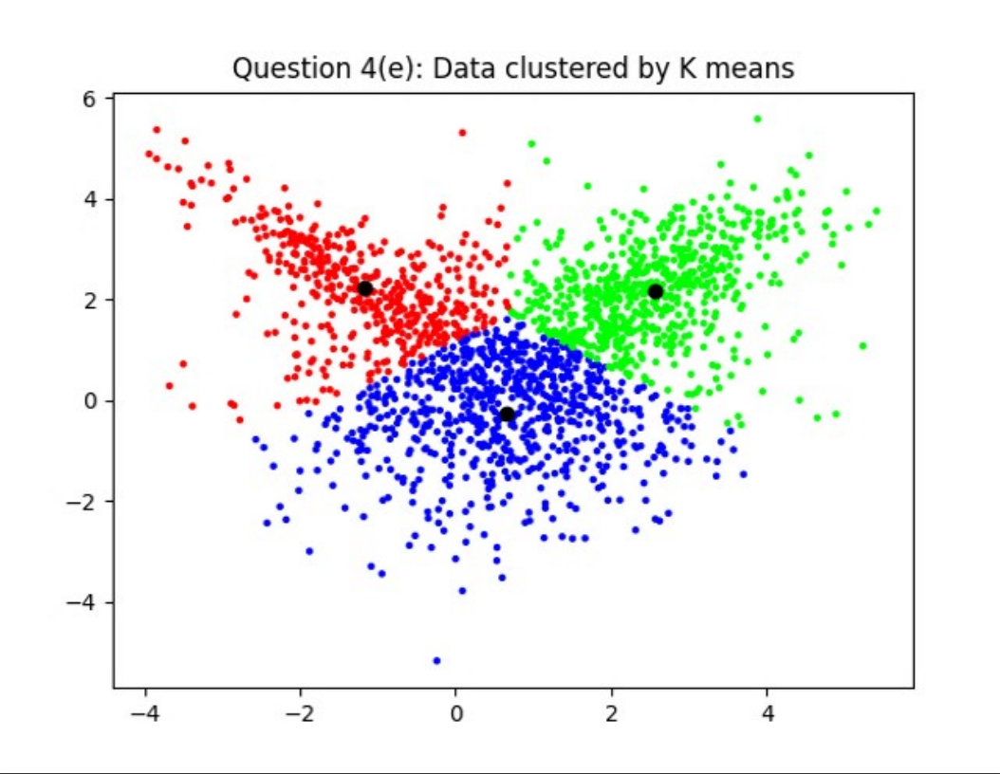
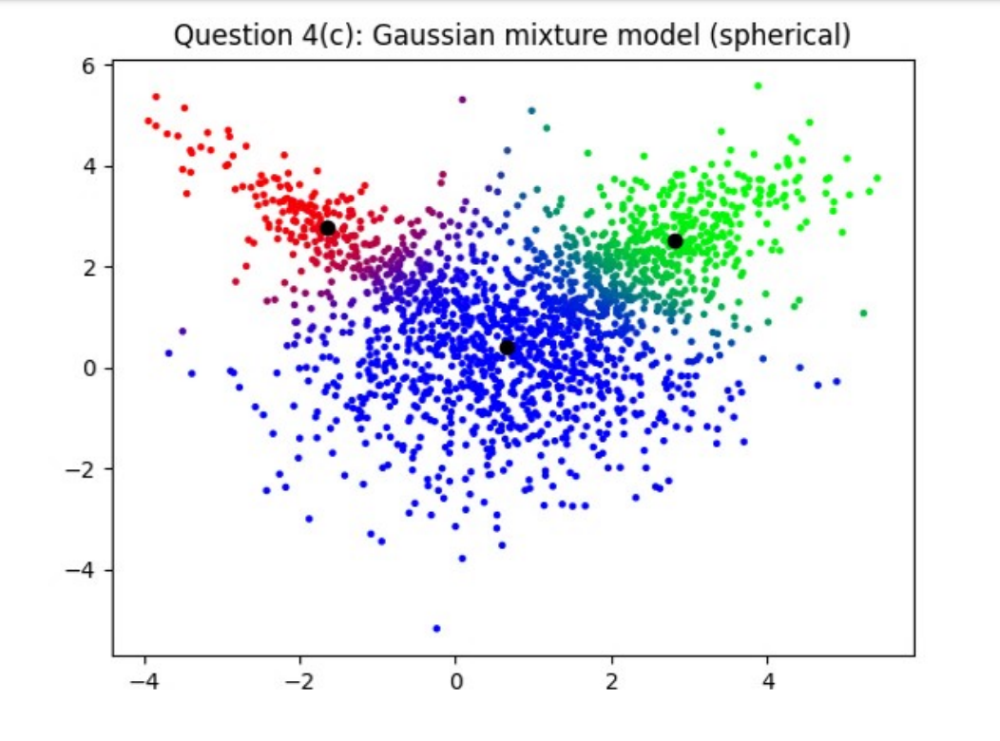

# Important Note
The [MNIST](https://en.wikipedia.org/wiki/MNIST_database) data is too large to be uploaded on github. There are two opitions to download the data.

- Extract [mnistTVT.zip](mnistTVT.zip)

- A google drive [download](https://drive.google.com/file/d/15qu5I-P4NV4yi5sWTO5Bk9L7hmyMQm4t/view?usp=sharing)

# Machine Learning Algorithmns
## Introduction
These are implementations of various machine learing algorithmns I created. They are compared with implementations from ```sklearn``` to validate their accuracy.
## Content
1. Neural Networks
2. Principal Component Analysis
3. Quantitive Discriminant Analysis
4. K-Means

# Neural Net | [nn.py](nn.py)
The setup of the neural net used in the data includes:



<u>My findings: </u>

With an increasing batch size the accuracy decreases and cross entropy increases. Since a growing batch size means that there is less training examples
used in one iteration (i.e. fewer steps) this means that it is not guaranteed
to converge to a global optimal point because of its faster convergence. Failing to converge results in a less than optimal prediction therefore means the
accuracy of a correct prediction must be lower. This also means that the
predicted probability diverges from the actual target label and results in an
5
increase in the cross entropy since probabilities of correct predictions is relatively lower.

The reason to why we don’t use a batch size of one is because as the amount
of training data points increases it will result in a substantial memory increase and performance decrease. This is because the number of iterations
will increase as more training points will have to be computed on, resulting
in more memory utilization. Also, with a batch size of one, every iteration
(step) might change in direction therefore adding more ”noise” which means
training might take longer and decrease the performance.

Executing on a massively parallel machine allows for simultaneous training for a single neural network. This means that a neural network can split data between the different neural nodes in each layer, this reduces training time by spreading out the computations between different processes.

# Quantitive Discriminant Analysis | [qda.py](qda.py)

For the small data set of 200 training points the maximum validation accu-racy occurs when the regularization parameter equals 2<sup>-8</sup>=0.00390625 (this is the true value, not the log-scaled value).



<u>My findings: </u>

Overfitting occurs when the regularization parameter is between 2<sup>-20</sup> and 2<sup>-9</sup> since its regularization parameter is near zero.  On my above figure, everything to the left of the highlighted critical point shows that the overfittedmodel  works  too  well  on  the  training  dataset  and  fails  on  the  validationdataset and decreases it accuracy.

Underfitting occurs when the regularization parameter is between 2<sup>-7</sup> and 2<sup>0</sup>=1 since its regularization parameter is close to one. On my above figure, everything to the right of the highlighted critical point shows that the overfitted model does not work well on the training dataset and fails on the validation dataset and decreases it accuracy.

# Principal Component Analysis | [pca.py](pca.py)

This type of analysis includes dimensionality reduction which can save on alot of resources and time when dealing with loads of data.

In my research including both PCA and QDA offered more benefit.

For the small data set of 200 training points the maximum validation accuracy occurs when the reduced     dimension equals to 8 (i.e. K=8).



<u>My findings: </u>

Overfitting occurs when the reduced dimension is between 9 and 50 (i.e. anything greater than K=8) since its reduced dimension is getting quite large. On my above figure, everything to the right of the highlighted critical point shows that the overfitted model works too well on the training dataset and fails on the validation dataset and decreases it accuracy.

Underfitting occurs when the reduced dimension is between 1 and 7 (i.e. anything less than K=8) since its reduced dimension is getting quite small. On my above figure, everything to the left of the highlighted critical point shows that the overfitted model does not work well on the training dataset and fails on the validation dataset and decreases it accuracy.

# PCA + QDA | [Images](graphs_and_plots/pca_and_qda_accuracy.pdf)

<u>My findings: </u>

When applying a dimensionaility reduction before classifing numbers using QDA it significantly improves performance while still providing high accuracies. 

# K-Means | [kmeans.py](kmeans.py)

Both Gaussian Mixture and K-Means are included, and the results are incredibile. 



<u>The findings:</u>

The kmeans algorithmn has a linear decision boundary and offers less robust accuracies that belong to either one class or another. 



<u>The findings:</u>

The guassian mixture (gm) algorithmn has a percentage decision boundary that offers robust accuracies that belong to multiple classes at once, without defining each data point to a specific class. 

# Decision Boundaries | [Images](graphs_and_plots/multiclass_classification.pdf)

<u>My findings: </u>

I visualized my findings playing with the hyper parameters between k-means, neural networks and GMM. Some parameters yeild significantly better accuracies along the clusters.
